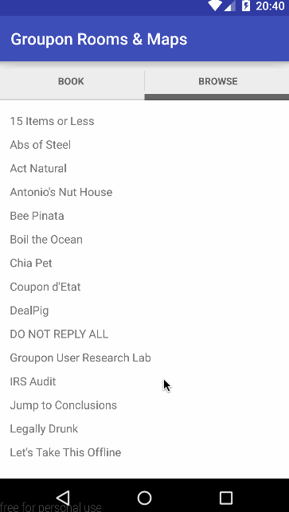

# Groupon Maps for Android

## Description and Purpose

Show maps of all Groupon meeting rooms. You can see the schedules for them and you can make your own reservations.

* [x] When the app first starts user sees a login screen (Google Login Screen)
* [x] Save auth token to preferences
* [x] User sees a list of available rooms for the next hour 
* [x] User can click on one of those to book it
* [x] After booking user is shown a "Map View" which displays the location of the room on a map
* [x] user may use the map view directly by going to the browse tab in which all the rooms are present
	- clicking a room takes the user to the map for that room

GIF created with [LiceCap](http://www.cockos.com/licecap/).

* [ ] Maps View
* [ ] 3d is even better
* [ ] Beacons
* [ ] Cameras
* [ ] Take into account when participants are free (find the best time for everyone)
* [ ] Show what meeting is on so that it can be determined if the meeting can be cancelled

